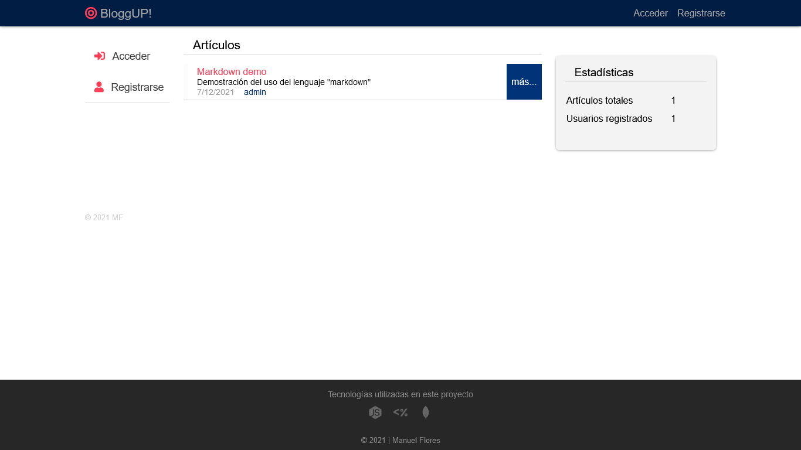
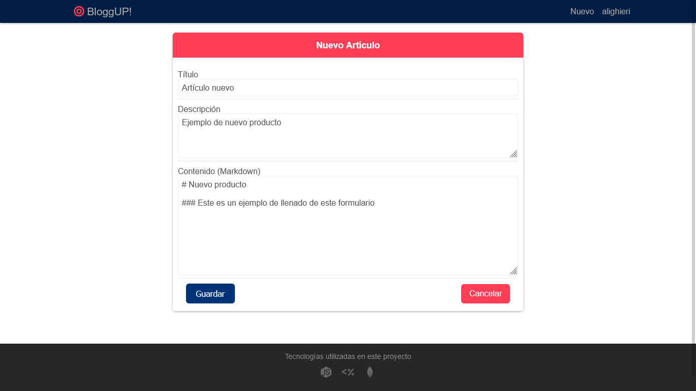
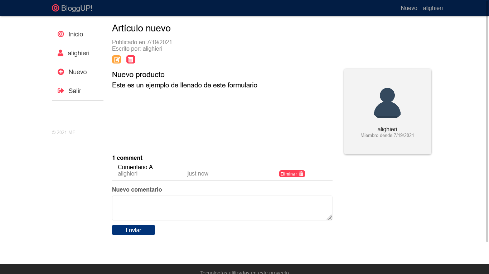

# BloggUp

Proyecto realizado con [NodeJs](https://nodejs.org/en/), [MongoDB](https://www.mongodb.com/) y [EJs](https://ejs.co/).

# Imágenes

> #### Vista principal de la aplicación
>
> Se muestran los artículos agregados por los usuarios

> 

> #### Vista de formulario para agregar un nuevo artículo
>
> El campo "contenido" se introduce en lenguaje [Markdown](https://www.markdownguide.org/).

> 

> #### Vista del artículo creado



> El autor del artículo puede modificarlo o editarlo. Los usuarios también pueden realizar comentarios, siempre y cuando estén "logueados"

## Uso

Instalar módulos del proyecto

```bash
npm install
```

Configurar base de datos MongoDB en el archivo:

```bash
  api/src/config/Database.ts
```

Iniciar servidor

```bash
npm run dev
```
